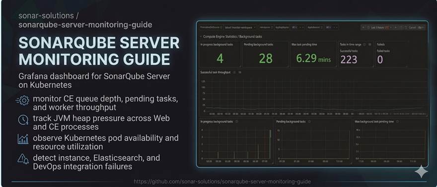

# Monitoring SonarQube Server

This guide covers operational monitoring for SonarQube Server — what to watch, how to query it, and how to set up Prometheus-based monitoring on Kubernetes.

## Why monitoring matters

SonarQube Server runs continuous background processing. The Compute Engine (CE) workers pull analysis tasks from a queue and process them one after another. If the queue backs up, developers wait for results. If a worker runs out of heap, it crashes silently and the queue stalls. None of this is visible in the UI until the problem is already affecting users.

Operational monitoring gives you early warning before problems surface:

- **Queue depth** spikes indicate a slowdown before anyone notices
- **JVM heap** trends let you right-size memory before an OOM crash
- **Worker saturation** tells you whether you need more CE workers or a faster instance
- **Application health** exposes internal component failures that do not necessarily take the whole instance down

## What this guide covers

| Page | Description |
|------|-------------|
| [What to monitor](docs/what-to-monitor.md) | The metrics sources, what each exposes, and a map of which signals to watch |
| [Prometheus alert catalogue](docs/prometheus-queries.md) | PromQL alerts with recommended thresholds and durations |
| [Kubernetes monitoring](docs/kubernetes/README.md) | Prerequisites and setup options for Kubernetes deployments |
| ↳ [kube-prometheus-stack](docs/kubernetes/kube-prometheus-stack.md) | Setup guide for the Prometheus Operator |
| ↳ [Azure managed Prometheus](docs/kubernetes/azure-managed-prometheus.md) | Setup guide for AKS + Azure Monitor managed Prometheus |
| [Grafana dashboard + how-to](dashboards/sonarqube-grafana-prometheus-k8s/) | Pre-built Grafana dashboard for Kubernetes deployments, with a per-section usage guide |

## What this guide does not cover

- SonarQube Server on VMs — a separate guide is planned
- Datadog, Dynatrace, or other vendor-specific observability platforms
- **Database metric panels** — the guide explains *why* to monitor the database tier, but ships no DB panels (database monitoring is engine- and infrastructure-specific)
- **Deep usage analytics** — per-user activity and per-project Lines of Code trends. (License status, total LOC utilization against the license, and IDE-connection counts *are* covered, as operational signals.)
- Prometheus or Grafana fundamentals — see the [Prometheus documentation](https://prometheus.io/docs/) and [Grafana documentation](https://grafana.com/docs/) for those

## Supported versions

This guide targets **SonarQube Server 2025.1 LTA and later**, all editions (Community Build, Developer, Enterprise, Data Center Edition), deployed on **Kubernetes** via the [official Helm chart](https://github.com/SonarSource/helm-chart-sonarqube).

## Official documentation reference

For the canonical reference on SonarQube monitoring configuration, see the [SonarQube Server documentation](https://docs.sonarsource.com/sonarqube-server/latest/instance-administration/monitoring/instance/).
