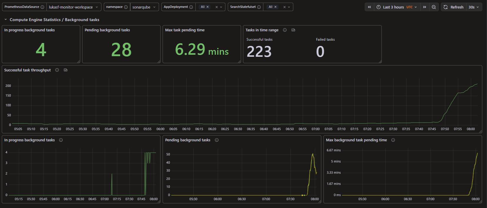

# How to Use the SonarQube Server Grafana Dashboard for Kubernetes

This page explains each section of the SonarQube Server Grafana dashboard: what each panel shows, why it matters operationally, and how to act on the information it surfaces.

The dashboard targets SonarQube Server deployed on Kubernetes, with Prometheus as the metrics backend.

## Quick Glance

The Quick Glance row gives a high-level snapshot of your SonarQube Server instance: whether it is up, how the license is looking, and how much analysis work it has been doing. It is designed to be read at a glance before drilling into any of the detail sections below.

### Is SQS Up

Shows whether SonarQube Server is currently reachable and reporting metrics. The value is either **OK** (no color) or **Down** (red background).

Rather than polling a dedicated health endpoint, this panel detects *absence* of the `sonarqube_web_uptime_minutes` metric. If SonarQube stops reporting — because it crashed, was OOM-killed, or is stuck in a restart loop — the metric disappears from Prometheus within one scrape interval and the panel immediately turns red. This indirect approach is well-suited to the Prometheus scrape model, where the absence of data is itself a meaningful signal.

### LOC Utilization

Shows what percentage of your licensed lines of code (LOC) has been analyzed. Turns **yellow at 80%** and **red at 90%**.

When the limit is reached (100%), SonarQube stops accepting new analyses — no new scans will be processed until the license is upgraded or renewed. The yellow threshold at 80% is designed to give you enough runway to initiate a license upgrade before the situation becomes critical.

### Time to License Expiry

Shows how many days remain before the SonarQube license expires. Turns **yellow when fewer than 30 days remain** and **red when fewer than 7 days remain**.

An expired license prevents SonarQube from functioning. This panel provides an early warning so license renewal can be planned before any service interruption.

### SQ IDE Connections

Shows the number of SonarQube for IDE (formerly SonarLint) clients currently connected to the server.

This panel gives insight into active developer usage. A consistently low or zero count in a team that has the IDE plugin configured may indicate a connectivity or configuration issue. Conversely, a spike in connections can help correlate periods of high server load with IDE-driven traffic as opposed to CI-triggered analysis.

### Background Tasks in the Last 24 Hours

Shows the total number of Compute Engine background tasks — both successful and failed — processed in the past 24 hours.

## Compute Engine Statistics / Background Tasks

The Compute Engine (CE) is the SonarQube component responsible for processing background tasks: code analysis, portfolio recomputation, authentication synchronization, SCA rescans, and more. It is also the component most sensitive to resource constraints. A backed-up CE queue is usually the first and most reliable signal of a performance problem.

This section surfaces the current state of the CE queue (stat panels at the top) and the historical trend of each metric (time series charts below). Use the stat panels for a quick read when opening the dashboard; use the time series charts when you need to understand *how long* a problem has been going on.

### In Progress Background Tasks (stat)

Shows how many background tasks are currently being processed by the Compute Engine at this moment.

This is the live count of active workers. Each SonarQube instance runs a fixed number of Compute Engine worker threads. In normal operation this value is either 0 (idle) or a small positive number reflecting active work. Sustained high values — close to or equal to the worker count — mean all workers are busy and new tasks will queue.

This panel does not have color thresholds. It will not change color regardless of the value. Monitor it as part of the broader queue picture.

### Pending Background Tasks (stat)

Shows the current number of background tasks waiting in the queue to be processed.

When all CE workers are occupied, incoming tasks are held in a queue. This counter reflects the current backlog. A value of 0 is normal. A steadily growing value means tasks are arriving faster than they can be processed — which may indicate resource exhaustion, a misconfigured worker count, or an unusually large analysis batch.

There are no universal thresholds for what constitutes a problem — the right baseline depends on your server's size and typical load. Establish a normal range for your installation and treat sustained deviation from it as a signal worth investigating.

This panel does not have color thresholds. It will stay green at any value.

### Max Task Pending Time (stat)

Shows how long the longest-waiting task in the queue has been waiting, in milliseconds.

This is a more sensitive health indicator than the pending count alone. A queue of 5 tasks that clears in seconds is fine; a queue of 5 tasks where one has been waiting for 10 minutes is not. A high max pending time that is not decreasing means the head of the queue is stuck or the CE is processing very slowly.

As with the pending count, there are no one-size-fits-all thresholds. Track what is normal for your environment and alert when this value remains elevated for longer than your typical analysis duration.

This panel does not have color thresholds. It will stay green at any value.

### Tasks in Time Range (stat)

Shows the total number of **successful** and **failed** Compute Engine tasks within the dashboard's currently selected time range. The two numbers are shown side by side.

The time range is controlled by Grafana's time range selector (top right of the dashboard) — changing it will update this panel accordingly.

**Successful tasks** give you a sense of throughput for the period: how much analysis work the server actually completed.

**Failed tasks** are normally rare. A single occasional failure may be caused by a broken project configuration or a transient error. A growing count of failures, or any failures during a period that looked healthy on other panels, warrants investigation. The two numbers together let you calculate the failure rate, which is often more meaningful than the raw failed count.

### Successful Task Throughput (time series)

Shows CE task throughput over time. At any point on the chart, the value represents the number of successfully completed background tasks in the **preceding one hour**.

This chart is primarily a traffic and usage pattern tool. It lets you see peak analysis times, quiet periods, and unusual spikes or drops in activity. A spike can be correlated with scheduled CI runs. A drop to zero during a period when you would normally expect activity may indicate the CE has stopped processing tasks — check the pending queue and CE logs.

### In Progress / Pending / Max Pending Time (time series)

The three time series charts at the bottom of this section show the same metrics as the stat panels above, but as historical trends over the selected time range.

**In progress background tasks** (left): how many tasks were actively running at each point in time.

**Pending background tasks** (center): the raw pending count as reported by each pod. In Data Center Edition deployments with multiple nodes, each pod reports the global pending count independently — their values may differ slightly due to scrape timing. The absolute values matter less than the overall trend: is the queue growing, stable, or clearing?

**Max background task pending time** (right): the longest queue wait time per pod, over time. The same caveat about per-pod values applies. Use this chart to assess how *sustained* a queue problem is. A brief spike followed by recovery is very different from a value that has been elevated for hours.

## Status

This section monitors two distinct subsystems: the DevOps platform integrations and the embedded Elasticsearch service. Both are critical for SonarQube to function correctly. An integration failure blocks pull request decoration; an Elasticsearch failure takes down the entire application.

### DevOps Integrations

Shows the health status of SonarQube's connections to each DevOps platform: **GitHub**, **GitLab**, **Azure DevOps (ADO)**, and **Bitbucket**. Each platform appears as a labeled value showing either **OK** (neutral text — healthy) or **Error** (red — unhealthy).

The panel queries the minimum status reported across all pods for each platform. A value of 1 means healthy and 0 means unhealthy, so taking the minimum ensures that a single pod reporting a bad connection is surfaced rather than averaged away.

**Important caveat — unconfigured integrations show as Error.** SonarQube returns an error status for integrations that are not configured, not just for integrations that are configured but failing. If your installation does not use GitLab or Bitbucket, those entries will show red even though nothing is actually broken.

To eliminate this noise, you have two options after deploying the dashboard:

- **Remove the unused query targets** in the panel editor — each platform (GitHub, GitLab, ADO, Bitbucket) is a separate query and can be deleted individually without affecting the others.
- **Update the value mapping** for the 0 value to display something like "N/A" instead of "Error" for the platforms you do not use, so the panel communicates "not applicable" rather than "broken."

When a platform you *do* use turns red, it means at least one DevOps connection for that platform is failing. This blocks pull request decoration — SonarQube cannot post analysis results back to the repository host. Check the DevOps integration settings in the SonarQube Administration UI and verify network connectivity from the SonarQube pods to the DevOps platform.

### ElasticSearch

Shows the overall health of the embedded Elasticsearch service. Displays **OK** (neutral text) when the cluster status is green or yellow, and **Error** (red) when the status is RED.

A RED Elasticsearch cluster status is serious: it means one or more primary shards are unavailable. Unlike yellow (reduced redundancy, continued operation), RED means data is inaccessible and SonarQube will malfunction.

When this panel shows Error, investigate logs in this order:

1. **es.log** — start here; this is where Elasticsearch reports cluster-level problems
2. **ce.log** — Compute Engine errors often follow from an ES problem
3. **web.log** — the web process may also log symptoms

### ElasticSearch Storage Utilization

Shows what percentage of the disk backing Elasticsearch is occupied, reported per node. The background turns **yellow at 60%** and **red at 85%**.

Elasticsearch has its own built-in protection against disk exhaustion: when utilization exceeds approximately 90%, it automatically switches to read-only mode. At that point, SonarQube goes down because it can no longer write to the index.

The thresholds in this panel are intentionally set below that limit to give you time to act:

- **Below 60% (no color):** Normal operating range.
- **60% (yellow):** Start planning a storage expansion. You still have comfortable headroom, but do not leave this unaddressed.
- **85% (red):** Act immediately. You are approaching Elasticsearch's automatic read-only threshold at 90%. Increase the persistent volume size — on Kubernetes, this means resizing the PersistentVolumeClaim (PVC) backing the Elasticsearch StatefulSet.

In Data Center Edition deployments with multiple Elasticsearch nodes, the panel shows one value per node. All nodes share the same index data, but each has its own disk — track the highest utilization value as your leading indicator.

### ElasticSearch: Storage Used

Shows the absolute amount of data currently stored on the disk(s) used by Elasticsearch, in bytes, per node. This panel has no color thresholds — it is informational only.

This value provides a sizing reference: it gives you a sense of how large the Elasticsearch index has grown. Paired with the utilization percentage above, you can derive the total volume size (used ÷ utilization).

**Important caveat for Kubernetes:** This panel is only meaningful if Elasticsearch persistence is enabled (i.e., the StatefulSet is backed by a PersistentVolume). Without persistence, Elasticsearch data lives on the node's ephemeral disk, and this panel reflects the worker node's overall disk usage — which has no relationship to the Elasticsearch index size and should be disregarded.

## SonarQube Web and Compute Engine JVM Metrics

This section shows JVM heap memory usage for the two main SonarQube processes: the Web server and the Compute Engine. Both processes have separately configurable maximum heap sizes, and these charts are the primary tool for determining whether those limits need to be increased.

The charts display **committed heap as a percentage of the configured maximum heap**. Committed heap is the amount of memory the JVM has reserved and guaranteed for its own use. Unlike *used* heap — which oscillates rapidly as the garbage collector reclaims and reallocates memory — committed heap grows steadily under load and rarely shrinks. This makes it a stable, forward-looking indicator of memory pressure: a rising committed/max ratio means the JVM is expanding toward its ceiling, independent of GC cycle timing.

Neither chart renders visual threshold lines, but 80% serves as a practical reference point: sustained values at or above that level are worth investigating.

### SonarQube JVM Heap Space: Web

Shows committed heap as a percentage of the configured maximum heap for the **Web server process**, over the selected time range. Each pod appears as a separate line. The legend below the chart shows the mean, 90th-percentile (p90), and maximum values for each pod over the visible range.

The Web server handles all HTTP traffic: the UI, the API, and connections from IDE plugins and scanners. Heap demand scales with concurrent user activity and the volume of API requests.

**How to read it:**

- **Low, stable values:** Normal. The JVM has not had to expand significantly from its initial allocation.
- **Gradually rising trend:** The JVM is growing its committed heap in response to increased load. Normal during peak usage periods; a concern if the trend continues into quiet periods.
- **Sustained above ~80%:** The Web process is consistently close to its memory limit. Watch for increased garbage collection pauses and slower API response times. Plan to increase the heap ceiling.
- **Near 100%:** Immediate action required. The JVM is fully committed against its configured maximum. Out-of-memory errors and pod restarts are likely.

**How to increase the Web process heap:** Set the `-Xmx` flag (maximum heap size) in `sonar.web.javaOpts`.

- *Community Build, Developer Edition, Enterprise Edition:* under the `sonarProperties` section of the Helm values file.
- *Data Center Edition:* under `applicationNodes.sonarProperties`.

In Data Center Edition deployments, multiple pods run the Web process and each shows as a separate line. Monitor all lines — if one pod shows elevated heap while others are normal, check whether it is receiving disproportionate traffic.

### SonarQube JVM Heap Space: CE

Shows committed heap as a percentage of the configured maximum heap for the **Compute Engine process**, over the selected time range. Each pod appears as a separate line. The legend shows mean, p90, and max values.

The Compute Engine processes background tasks — analysis processing is the most memory-intensive of these, and heap demand scales directly with analysis size and complexity.

**How to read it:**

- **Low, stable values:** Normal during quiet periods.
- **Spikes that correlate with analysis activity and then recover:** Expected behavior. Large analyses consume more heap; the JVM may retain committed memory after the spike even after GC cycles reduce used heap.
- **Sustained above ~80%, even during quiet periods:** The CE process is consistently running close to its limit. This can cause slow analysis processing and, if the JVM runs out of heap, failed background tasks.
- **Near 100%:** Immediate action required. Failed analyses and CE process restarts are likely.

**How to increase the CE process heap:** Set the `-Xmx` flag in `sonar.ce.javaOpts`.

- *Community Build, Developer Edition, Enterprise Edition:* under `sonarProperties` in the Helm values file.
- *Data Center Edition:* under `applicationNodes.sonarProperties`.

In Data Center Edition, the CE process runs in separate application pods and each pod processes tasks independently. A pod with an elevated heap line is working through demanding analyses. If one pod is consistently higher than others, its workload is heavier — this is normal if tasks are unevenly distributed, but persistent 100% values on any single pod require a heap increase.

## Scraping Performance

Prometheus collects metrics from SonarQube by periodically sending HTTP requests to its monitoring endpoints — a process called scraping. This section tracks how long each of those requests takes.

Scrape duration is not a SonarQube application metric; it is a Prometheus-side observation. But because SonarQube's web server handles scraping requests alongside all other HTTP traffic, a slow web server produces slow scrapes. That makes scrape duration a useful secondary health signal — one that can reflect degraded performance even before other symptoms become visible.

### Scrape Duration

**What it shows:** The time in seconds Prometheus spent on each scrape, broken down by pod and endpoint. Each line in the chart represents one pod+endpoint pair. The legend on the right shows **mean**, **p99**, and **max** scrape durations over the visible time range.

A typical SonarQube pod exposes three monitored endpoints, shown in the legend by their `endpoint` label:
- **`http`** — the SonarQube application metrics endpoint (`/api/monitoring/metrics`). This is the source for most of the data shown elsewhere in the dashboard.
- **`monitoring-web`** — the Web server process endpoint (JVM metrics).
- **`monitoring-ce`** — the Compute Engine process endpoint (JVM metrics).

**Why it matters:** Under normal conditions, scrapes complete in tens to a few hundred milliseconds. A sustained increase — especially on the `http` (application metrics) endpoint — signals that SonarQube's web server is responding slowly. This can mean the server is under heavy load, running low on heap, or experiencing another resource bottleneck.

There is no single threshold value to treat as an alarm. What matters is the **trend**: a stable value at any level is fine; a value that is climbing and not recovering warrants investigation.

**How to use it:**

- **Stable, low values:** Normal. No action needed.
- **Occasional spikes that recover quickly:** Expected under transient load. If mean and p99 remain low, isolated spikes are not a concern — the max column in the legend captures the single worst scrape in the period and will naturally be higher than p99.
- **Sustained increase — mean or p99 rising over minutes or hours:** Investigate SonarQube performance. Cross-reference with:
  - **Compute Engine Statistics** — is the pending task queue growing? A backed-up queue indicates CE saturation, which correlates with broader server slowness.
  - **JVM Heap Space** — is the Web or CE process approaching its heap limit? Heap exhaustion causes garbage collection pressure that slows all server responses, including scrapes.
- **Scrape duration rising while other metrics look healthy:** Consider whether the Prometheus scrape interval is too aggressive. If SonarQube is being scraped more frequently than it can comfortably respond, increasing the scrape interval can reduce the load.

## Kubernetes Metrics

This section exposes infrastructure-level signals from the Kubernetes monitoring stack rather than from the SonarQube application itself. Together with the JVM and CE statistics sections, it gives a complete picture of how your deployment is behaving: not just what SonarQube is doing inside the JVM, but whether the pods are healthy, whether the cluster is assigning them enough compute, and whether resource limits are sized for actual demand.

The panels are organized around two pod groupings that reflect SonarQube's deployment topology:

- **StatefulSet pods** — on Community Build, Developer Edition, and Enterprise Edition, this is the single SonarQube pod. On Data Center Edition (DCE), these are the Elasticsearch search pods, which are managed as a StatefulSet.
- **Deployment pods (DCE only)** — the application pods that run the Web server and Compute Engine processes in a DCE deployment.

### Application Uptime

Shows how long the longest-running SonarQube application pod has been up, derived from its Kubernetes start time. The value is reported as a duration.

The query takes the maximum elapsed time across all running non-search pods in the namespace — search pods are excluded. For DCE, this reflects the oldest application pod; for all other editions, the single SonarQube pod.

This panel does not change color. Its value is informational: after a crash or OOM kill, the uptime resets to near zero and climbs again. A sudden drop or an unexpectedly short uptime tells you a pod recently restarted — correlate it with the "Desired vs ready difference" panel and with the JVM heap charts to understand what caused the restart.

### StatefulSet Pod Replicas

Shows two values side by side: **Required** (the desired replica count from the StatefulSet spec) and **Ready** (the count of pods that have passed their readiness probe).

On Enterprise Edition and earlier editions, there is always 1 required pod. On DCE, this reflects the Elasticsearch search pods. This panel does not change color regardless of the values — a mismatch is easier to act on via the "Desired vs ready difference" panel, which applies a threshold color.

### App Pod Replicas

Shows the required and ready replica counts for the **application pods** in a DCE deployment. On non-DCE deployments, this panel shows **N/A - DCE only**.

Like the StatefulSet pod replicas panel, this is informational and does not change color. Use it alongside "Desired vs ready difference" and the time series chart to understand the current state of application pod availability in DCE.

### Desired vs Ready Difference

Shows the current gap between desired and ready pod counts, reported separately for **App** (deployment pods) and **Search** (StatefulSet pods). The value turns **yellow when 1 or more**.

- **Green (0):** All configured pods are running and passing their readiness checks. This is the expected steady state.
- **Yellow (1+):** At least one pod is not ready. This happens during normal rolling deployments as pods cycle out and replacements warm up. If the value returns to 0 within 10–15 minutes, no action is needed. If it stays elevated beyond that window, investigate: pods may be crash-looping, failing readiness probes, or unable to schedule due to resource pressure on the nodes. Check pod events and logs in Kubernetes.

On non-DCE deployments, only the Search row is relevant (there is no application deployment). On DCE, both rows are meaningful.

### SonarQube Replicas: Required and Ready (time series)

Shows the required and ready pod counts over time, for both the deployment (application pods) and the StatefulSet (search pods, or the single pod on non-DCE editions). This is the historical complement to the stat panels above.

Use this chart to determine whether a pod mismatch was a brief deployment transition or a sustained outage. A clean recovery pattern — ready dips briefly then returns to match required — indicates a normal restart. A flatline where ready stays below required for an extended period means pods are not recovering and requires investigation.

### StatefulSet CPU Core Utilization (time series)

Shows actual CPU usage alongside the configured **request** and **limit** lines for the StatefulSet pods. CPU is measured in cores (as a 5-minute rolling rate). This covers the single SonarQube pod on non-DCE editions, or the Elasticsearch search pods on DCE.

Three lines appear per pod:
- **Actual usage** — the CPU the container is actively consuming.
- **Request** — the CPU the Kubernetes scheduler guarantees this pod. The node always reserves this capacity.
- **Limit** — the ceiling above which the container cannot go. If actual usage reaches the limit, Kubernetes **throttles** the container: it cannot use more CPU even if the node has spare capacity.

CPU throttling does not kill pods, but it slows everything down. Analyses take longer, API responses become sluggish, and scrape durations rise. If actual usage frequently reaches or flatlines at the limit, raise both the CPU limit and request in the Helm values file. If usage consistently stays well below the request, the resources are over-provisioned and worth tuning.

### Deployment CPU Utilization — Application Pods (DCE only) (time series)

Same layout and interpretation as the StatefulSet CPU chart, but for DCE application pods (the pods running the Web server and Compute Engine). On non-DCE deployments, this chart is empty.

### StatefulSet Memory Utilization (time series)

Shows actual memory usage alongside the configured request and limit lines for the StatefulSet pods. Memory is measured in bytes. The metric (`container_memory_working_set_bytes`) reports the **working set** — the memory the kernel considers actively in use and not immediately reclaimable by GC or the OS.

Three lines appear per pod:
- **Actual usage (working set)** — what the container is actively using.
- **Request** — the memory the scheduler guarantees.
- **Limit** — the maximum the container is allowed. Unlike CPU, hitting the memory limit does not throttle: it triggers an **OOM kill**. The container is terminated immediately and the pod restarts.

An OOM kill resets pod uptime, interrupts any in-progress analyses (those tasks return to pending in the CE queue), and may briefly take a pod out of the ready pool. Watch this chart in combination with the JVM heap charts: JVM heap is allocated within the container's total memory budget. If heap demand is growing (visible in the JVM section), container memory usage will follow. Rising memory that is consistently approaching the limit is the signal to act — increase the memory limit and request in the Helm values file, and review whether the JVM heap ceiling also needs to be raised.

### Deployment Memory Utilization — Application Pods (DCE only) (time series)

Same layout and interpretation as the StatefulSet memory chart, but for DCE application pods. On non-DCE deployments, this chart is empty.

## Database

This section contains no metric panels. It carries a single explanatory note about why database monitoring matters and what to do about it.

SonarQube's performance depends directly on the health of its database. Resource exhaustion on the database server — whether CPU, memory, or disk I/O — will manifest inside SonarQube as slow API responses, long-running background tasks, and UI timeouts. The same is true of subtler problems: a saturated connection pool starves SonarQube of database connections, while neglected database maintenance (outdated query planner statistics, fragmented indexes) progressively degrades query performance. None of these problems are visible from the SonarQube application metrics alone.

**Why no panels are included:** Database monitoring is tightly coupled to the specific engine (PostgreSQL, Microsoft SQL Server, Oracle) and to the infrastructure it runs on. A meaningful set of panels would look very different for a managed cloud database versus a self-hosted instance, and the metrics available depend on what exporters or agents are deployed alongside the database. A generic set of placeholder panels would cause more confusion than they prevent.

**What to do instead:** Extend this dashboard — or run a dedicated database monitoring solution alongside it — to cover the database tier. For most production SonarQube deployments the most useful signals to track are:

- **CPU and memory utilization** on the database host or pod — sustained high values indicate resource pressure that will eventually affect SonarQube.
- **Disk I/O** — high read/write latency is one of the most common causes of slow SonarQube analyses and long Compute Engine task times.
- **Active connections** — if the database server is receiving more connections than expected, tasks will queue at the database layer.
- **Query performance** — slow queries and lock contention surface here before they are visible elsewhere.
- **Replication lag** (if your database uses a primary/replica setup) — SonarQube writes go to the primary and reads may go to replicas; lag can produce stale or inconsistent data.

When SonarQube shows unexplained sluggishness — long CE task times, slow UI, high scrape durations — and the JVM heap, CPU, and CE queue panels look healthy, the database is the next place to look.
